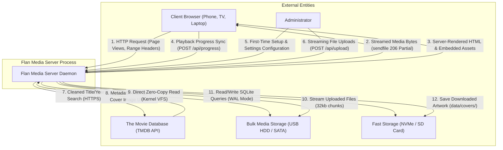
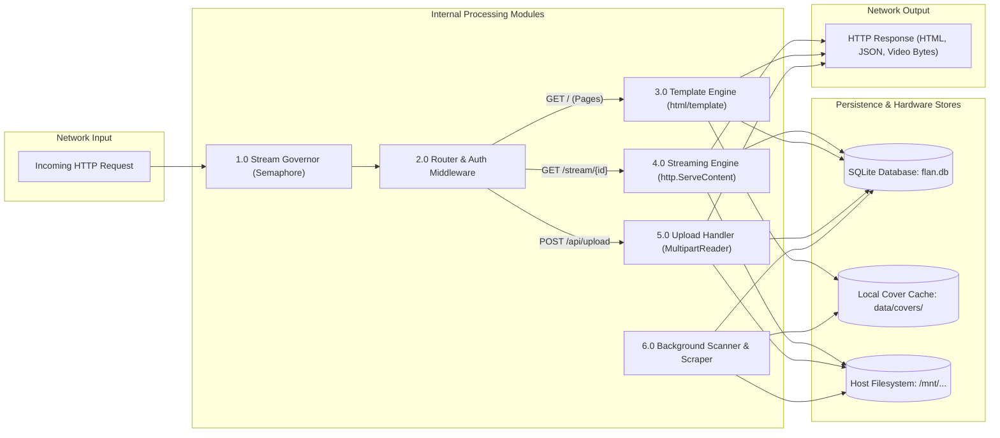
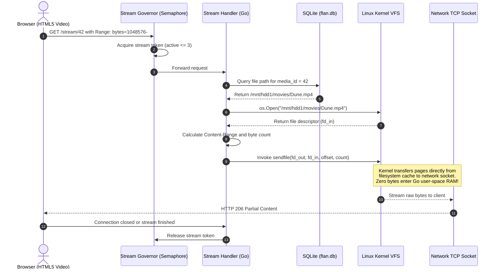
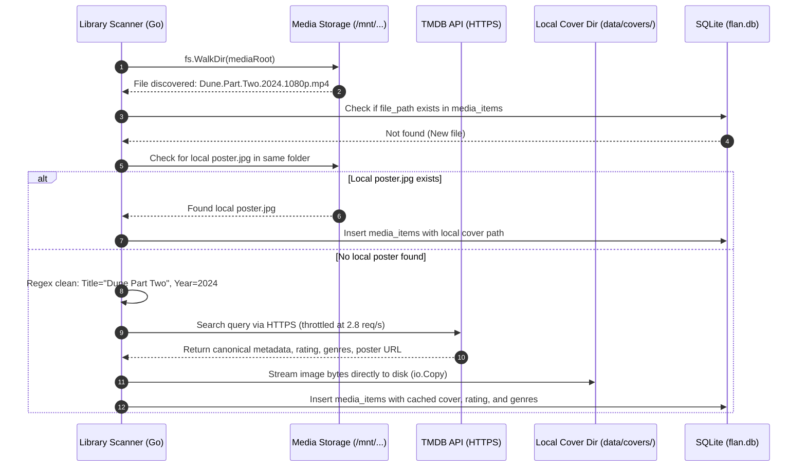
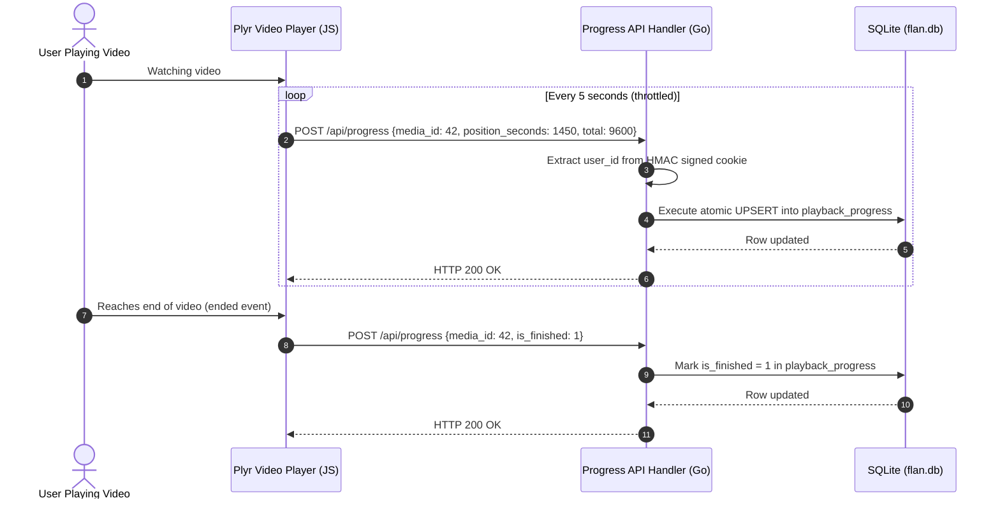
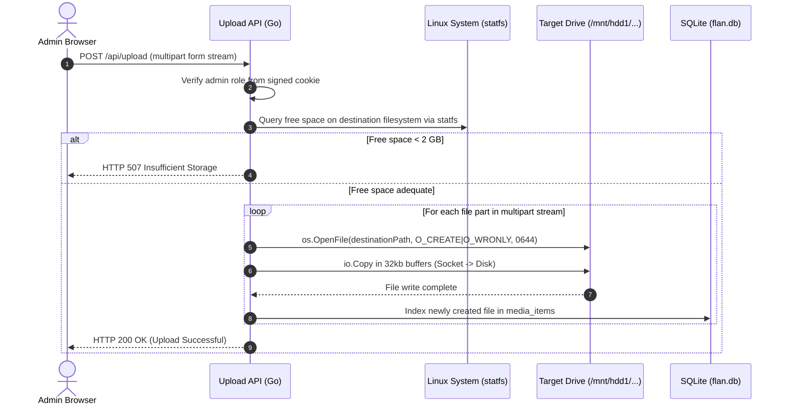

# Data Flow & Architecture Diagrams

This document visualizes the internal and external data flows of Flan Media Server using standard UML sequence diagrams and Data Flow Diagrams (DFD) rendered with Mermaid.

---

## 1. Context Data Flow Diagram (Level 0 DFD)

Illustrates the high-level boundary between external entities (browsers, filesystem drives, and metadata providers) and the core Flan Media Server process.

---

## 2. Component Data Flow Diagram (Level 1 DFD)

Breaks down the server process into distinct internal modules, illustrating how data moves between network listeners, middlewares, handlers, and persistence stores.

---

## 3. Zero-Copy Video Streaming Data Flow (UML Sequence)

Shows the exact call path for a media stream request, highlighting why video data bypasses Go's garbage-collected application heap.

---

## 4. Ingestion & Scraping Data Flow (UML Sequence)

Illustrates how newly added files are discovered, checked for local artwork, matched online, and stored locally.

---

## 5. Client Progress Tracking Data Flow

Illustrates the state sync loop between client playback and the SQLite database.

---

## 6. Admin Zero-Memory File Upload Data Flow

Illustrates how large video files are uploaded through the browser and streamed directly to disk without bloating RAM.

