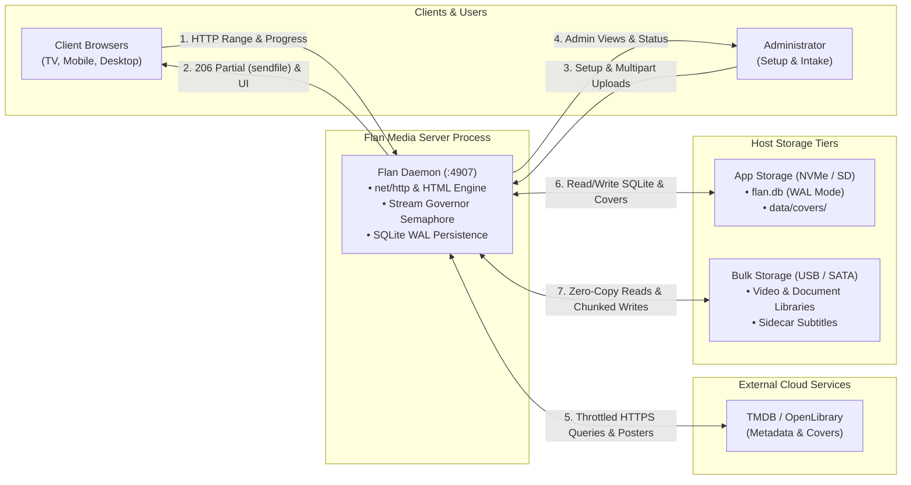
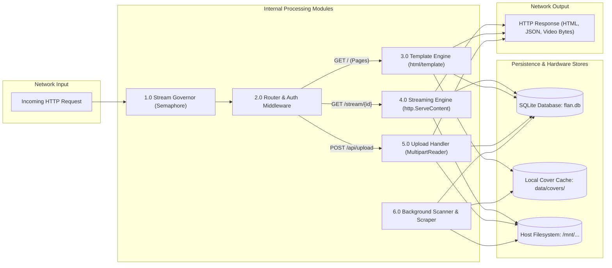
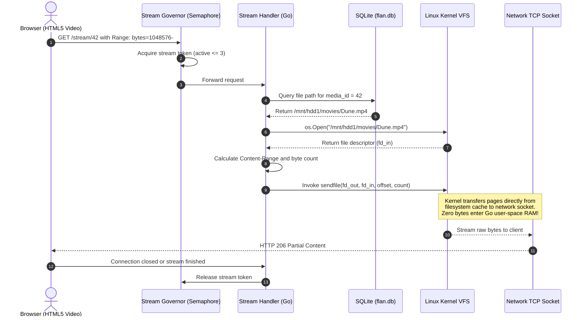
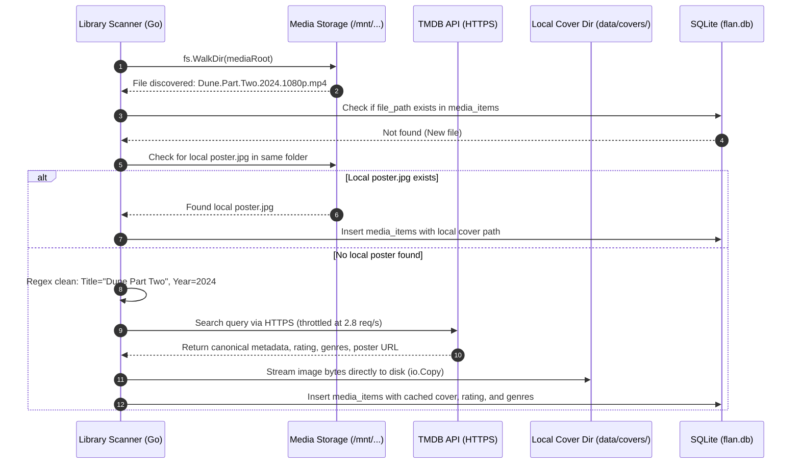
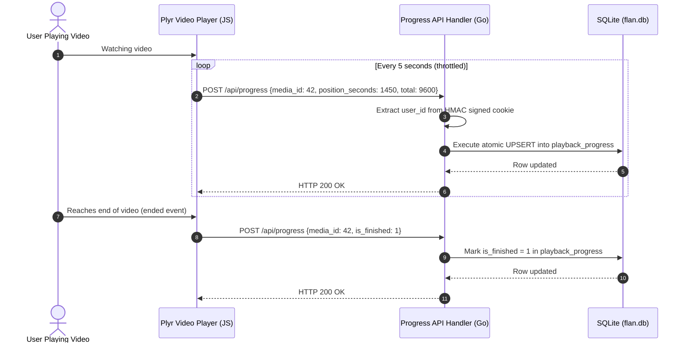
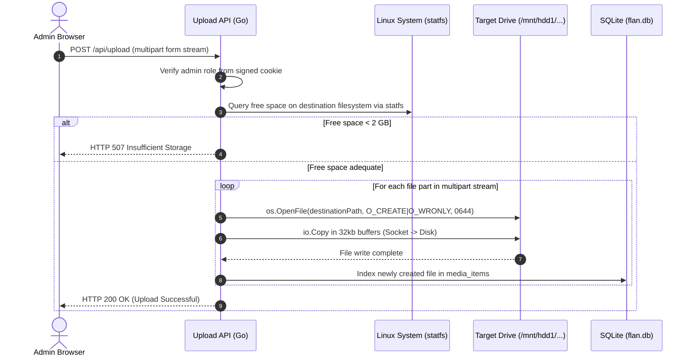

# Data Flow & Architecture Diagrams

This document visualizes the internal and external data flows using standard UML sequence diagrams and Data Flow Diagrams (DFD) rendered with Mermaid.

---

## 1. Context Data Flow Architecture (Level 0 DFD)

Illustrates the high-level boundaries between external actors, upstream providers, host storage tiers, and the core Flan Media Server daemon process.

### Context Data Flow Specification

| Ref | Channel | Direction | Protocol / Mechanism | Description & Payload |
| :--- | :--- | :--- | :--- | :--- |
| **1** | Client Inbound | Browser → Daemon | HTTP/1.1 (TCP :4907) | Page navigation, user PIN authentication, HTTP Range requests (`bytes=start-end`), and throttled playback progress (`POST /api/progress`). |
| **2** | Client Outbound | Daemon → Browser | HTTP 200 / 206 Partial | Server-rendered HTML templates with embedded CSS/JS, WebVTT subtitles, and zero-copy byte ranges streamed via Linux `sendfile`. |
| **3** | Admin Inbound | Admin → Daemon | HTTP/1.1 | Initial onboarding setup (`/setup`), library scan triggers (`/api/scan`), and multipart file uploads streamed in 32kb chunks (`/api/upload`). |
| **4** | Admin Outbound | Daemon → Admin | HTTP 200 / JSON | Server settings interface, hardware storage stats, scan task progress, and upload status responses. |
| **5** | Upstream Scraper | Daemon ↔ TMDB | HTTPS (Throttled ~2.8 req/s) | Outbound cleaned title queries to TMDB/OpenLibrary; inbound JSON metadata (ratings, overviews, genres) and streamed cover images. |
| **6** | App Persistence | Daemon ↔ App Storage | POSIX File I/O & SQLite WAL | Fast random I/O: SQLite transactions (`flan.db`) with 2mb page cache, `.flan-keep` mount verification, and local artwork storage (`data/covers/`). |
| **7** | Media Storage | Daemon ↔ Bulk Storage | Linux VFS / Kernel `sendfile` | Sequential media reads via kernel zero-copy transfer to network sockets, and direct socket-to-disk 32kb writes during admin uploads. |

---

## 2. Component Data Flow Diagram (Level 1 DFD)

Breaks down the server process into distinct internal modules, illustrating how data moves between network listeners, middlewares, handlers, and persistence stores.

---

## 3. Zero-Copy Video Streaming Data Flow (UML Sequence)

Shows the exact call path for a media stream request, highlighting why video data bypasses Go's garbage-collected application heap.

---

## 4. Ingestion & Scraping Data Flow (UML Sequence)

Illustrates how newly added files are discovered, checked for local artwork, matched online, and stored locally.

---

## 5. Client Progress Tracking Data Flow

Illustrates the state sync loop between client playback and the SQLite database.

---

## 6. Admin Zero-Memory File Upload Data Flow

Illustrates how large video files are uploaded through the browser and streamed directly to disk without bloating RAM.

---

### Related Documentation

+ [User Flows & Journey Diagrams](user-flows.md)
+ [Master System Specifications](../design.md)
+ [Five-Zone Rate Limiting Architecture](../rate-limiting.md)
+ [Storage Architecture & Drive Resiliency](../storage.md)
