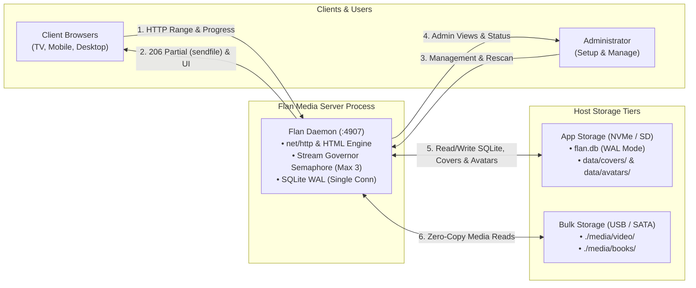
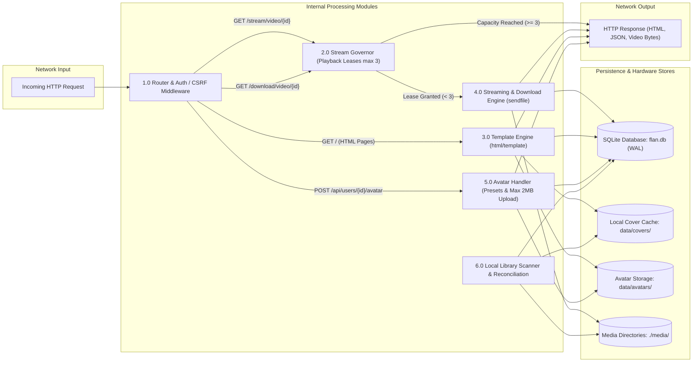
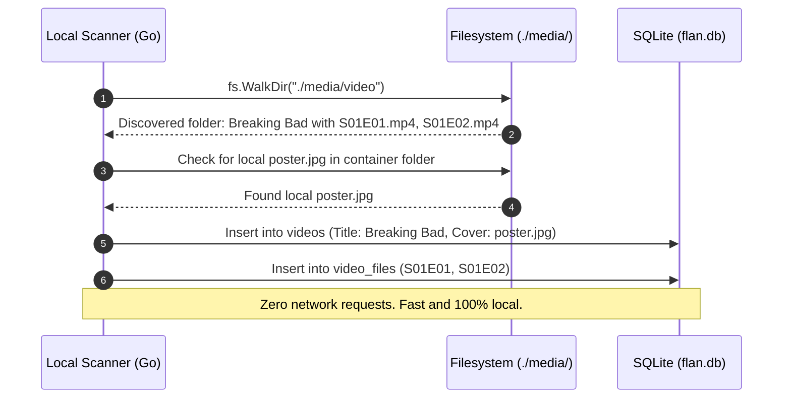
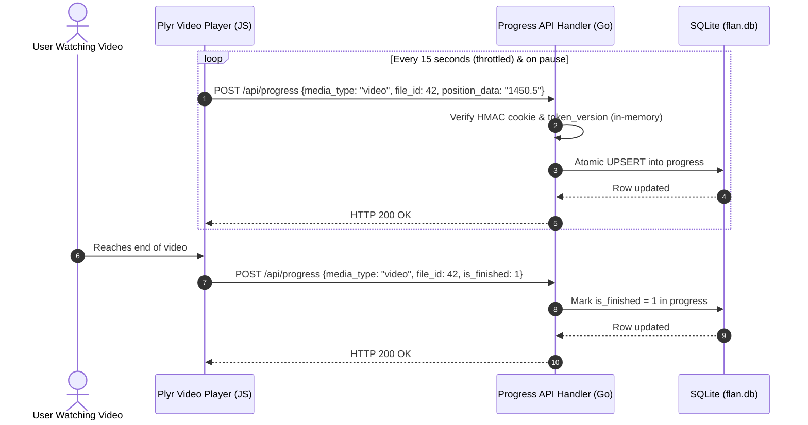
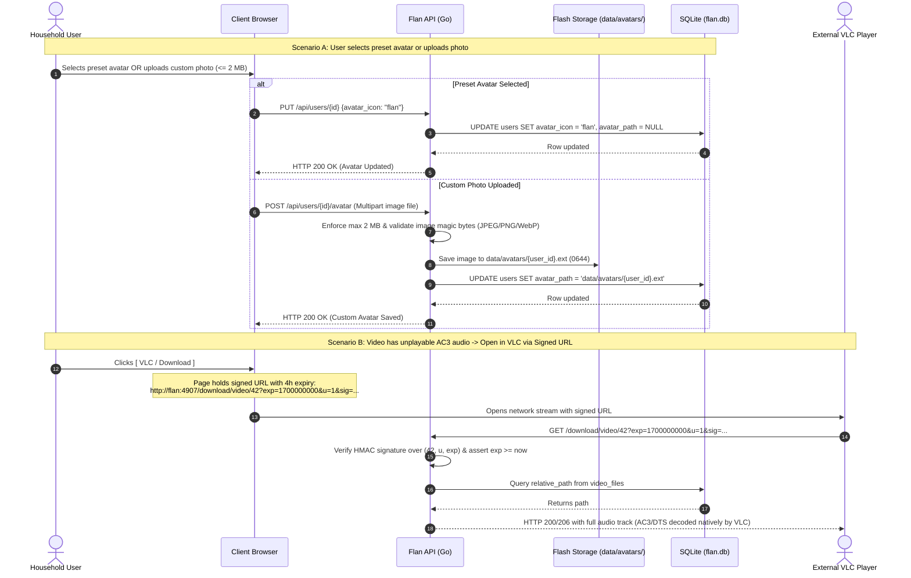

# Data Flow & Architecture Diagrams

UML sequence diagrams and Data Flow Diagrams (DFD) illustrating system data flows.

---

## 1. Context Data Flow (Level 0 DFD)

High-level boundaries between external clients, host storage tiers, and the Flan daemon process. Flan operates 100% offline with zero external cloud dependencies.

```mermaid
flowchart LR
    subgraph Clients["Clients & Users"]
        direction TB
        Browser["Client Browsers<br/>(TV, Mobile, Desktop)"]
        Admin["Administrator<br/>(Setup & Manage)"]
    end

    subgraph Core["Flan Media Server Process"]
        Daemon["Flan Daemon (:4907)<br/>• net/http & HTML Engine<br/>• Stream Governor Semaphore (Max 3)<br/>• SQLite WAL (Single Conn)"]
    end

    subgraph Storage["Host Storage Tiers"]
        direction TB
        AppData["App Storage (NVMe / SD)<br/>• flan.db (WAL Mode)<br/>• data/covers/ & data/avatars/"]
        BulkMedia["Bulk Storage (USB / SATA)<br/>• ./media/video/<br/>• ./media/books/"]
    end

    Browser -->|"1. HTTP Range & Progress"| Daemon
    Daemon -->|"2. 206 Partial (sendfile) & UI"| Browser
    Admin -->|"3. Management & Rescan"| Daemon
    Daemon -->|"4. Admin Views & Status"| Admin
    Daemon <-->|"5. Read/Write SQLite, Covers & Avatars"| AppData
    Daemon <-->|"6. Zero-Copy Media Reads"| BulkMedia
```

---

## 2. Component Data Flow (Level 1 DFD)

Internal data movement between router, middlewares, engines, and persistence layers.

```mermaid
flowchart LR
    subgraph Input["Network Input"]
        Request["Incoming HTTP Request"]
    end

    subgraph Core["Internal Processing Modules"]
        Router["1.0 Router & Auth / CSRF Middleware"]
        Governor["2.0 Stream Governor (Playback Leases max 3)"]
        PageEngine["3.0 Template Engine (html/template)"]
        StreamEngine["4.0 Streaming & Download Engine (sendfile)"]
        AvatarEngine["5.0 Avatar Handler (Presets & Max 2MB Upload)"]
        Scanner["6.0 Local Library Scanner & Reconciliation"]
    end

    subgraph Stores["Persistence & Hardware Stores"]
        SQLite[("SQLite Database: flan.db (WAL)")]
        Covers[("Local Cover Cache: data/covers/")]
        Avatars[("Avatar Storage: data/avatars/")]
        HostDrives[("Media Directories: ./media/")]
    end

    subgraph Output["Network Output"]
        Response["HTTP Response (HTML, JSON, Video Bytes)"]
    end

    Request --> Router
    Router -- "GET /stream/video/{id}" --> Governor
    Router -- "GET /download/video/{id}" --> Governor
    Governor -- "Lease Granted (< 3)" --> StreamEngine
    Governor -- "Capacity Reached (>= 3)" --> Response
    Router -- "GET / (HTML Pages)" --> PageEngine
    Router -- "POST /api/users/{id}/avatar" --> AvatarEngine
    StreamEngine --> SQLite
    StreamEngine --> HostDrives
    StreamEngine --> Response
    PageEngine --> SQLite
    PageEngine --> Covers
    PageEngine --> Avatars
    PageEngine --> Response
    AvatarEngine --> Avatars
    AvatarEngine --> SQLite
    AvatarEngine --> Response
    Scanner --> HostDrives
    Scanner --> SQLite
    Scanner --> Covers
```

---

## 3. Zero-Copy Video Streaming (UML Sequence)

Shows how byte range requests trigger Linux `sendfile`, moving data directly from kernel cache to socket buffers without touching Go heap RAM, governed by playback session leases.

```mermaid
sequenceDiagram
    autonumber
    actor Client as Browser (HTML5 Video)
    participant Gov as Stream Governor (Lease Tracker)
    participant Handler as Stream Handler (Go)
    participant DB as SQLite (flan.db)
    participant VFS as Linux Kernel VFS
    participant Socket as Network TCP Socket

    Client->>Gov: GET /stream/video/42 (Range: bytes=1048576-)
    Gov->>Gov: Check (session_id, 42) lease; refresh last_active (active <= 3)
    Gov->>Handler: Forward request with granted lease
    Handler->>DB: Query video_files for file_id = 42
    DB-->>Handler: Relative path under ./media/video/
    Handler->>Handler: Validate canonical path inside ./media/video/
    Handler->>VFS: os.Open("./media/video/Dune/Dune.mp4")
    VFS-->>Handler: File descriptor (fd_in)
    Handler->>Handler: Calculate Content-Range header
    Handler->>VFS: sendfile(fd_out, fd_in, offset, count)
    Note over VFS,Socket: Kernel transfers pages directly from<br/>filesystem cache to socket. Zero bytes in Go RAM.
    VFS-->>Socket: Stream raw bytes
    Socket-->>Client: HTTP 206 Partial Content
    Note over Gov: Lease automatically expires 30s after<br/>last range request or on pause/exit beacon.
```

---

## 4. Local Ingestion Data Flow (UML Sequence)

Scanning discovered media containers, local artwork verification, and direct SQLite insertion.

```mermaid
sequenceDiagram
    autonumber
    participant Scanner as Local Scanner (Go)
    participant Disk as Filesystem (./media/)
    participant DB as SQLite (flan.db)

    Scanner->>Disk: fs.WalkDir("./media/video")
    Disk-->>Scanner: Discovered folder: Breaking Bad with S01E01.mp4, S01E02.mp4
    Scanner->>Disk: Check for local poster.jpg in container folder
    Disk-->>Scanner: Found local poster.jpg
    Scanner->>DB: Insert into videos (Title: Breaking Bad, Cover: poster.jpg)
    Scanner->>DB: Insert into video_files (S01E01, S01E02)
    Note over Scanner,DB: Zero network requests. Fast and 100% local.
```

---

## 5. Playback Progress Sync Loop

Client playback synchronization with the normalized SQLite database.

```mermaid
sequenceDiagram
    autonumber
    actor User as User Watching Video
    participant Player as Plyr Video Player (JS)
    participant API as Progress API Handler (Go)
    participant DB as SQLite (flan.db)

    loop Every 15 seconds (throttled) & on pause
        Player->>API: POST /api/progress {media_type: "video", file_id: 42, position_data: "1450.5"}
        API->>API: Verify HMAC cookie & token_version (in-memory)
        API->>DB: Atomic UPSERT into progress
        DB-->>API: Row updated
        API-->>Player: HTTP 200 OK
    end
    User->>Player: Reaches end of video
    Player->>API: POST /api/progress {media_type: "video", file_id: 42, is_finished: 1}
    API->>DB: Mark is_finished = 1 in progress
    DB-->>API: Row updated
    API-->>Player: HTTP 200 OK
```

---

## 6. Avatar Selection & VLC Signed Stream Flow

Shows avatar updates (preset or custom upload) and direct VLC streaming bypassing browser codec limits using short-lived signed URLs.

```mermaid
sequenceDiagram
    autonumber
    actor User as Household User
    participant Browser as Client Browser
    participant API as Flan API (Go)
    participant Disk as Flash Storage (data/avatars/)
    participant DB as SQLite (flan.db)
    actor VLC as External VLC Player

    Note over User,DB: Scenario A: User selects preset avatar or uploads photo
    User->>Browser: Selects preset avatar OR uploads custom photo (<= 2 MB)
    alt Preset Avatar Selected
        Browser->>API: PUT /api/users/{id} {avatar_icon: "flan"}
        API->>DB: UPDATE users SET avatar_icon = 'flan', avatar_path = NULL
        DB-->>API: Row updated
        API-->>Browser: HTTP 200 OK (Avatar Updated)
    else Custom Photo Uploaded
        Browser->>API: POST /api/users/{id}/avatar (Multipart image file)
        API->>API: Enforce max 2 MB & validate image magic bytes (JPEG/PNG/WebP)
        API->>Disk: Save image to data/avatars/{user_id}.ext (0644)
        API->>DB: UPDATE users SET avatar_path = 'data/avatars/{user_id}.ext'
        DB-->>API: Row updated
        API-->>Browser: HTTP 200 OK (Custom Avatar Saved)
    end

    Note over User,VLC: Scenario B: Video has unplayable AC3 audio -> Open in VLC via Signed URL
    User->>Browser: Clicks [ VLC / Download ]
    Note over Browser: Page holds signed URL with 4h expiry:<br/>http://flan:4907/download/video/42?exp=1700000000&u=1&sig=...
    Browser->>VLC: Opens network stream with signed URL
    VLC->>API: GET /download/video/42?exp=1700000000&u=1&sig=...
    API->>API: Verify HMAC signature over (42, u, exp) & assert exp >= now
    API->>DB: Query relative_path from video_files
    DB-->>API: Returns path
    API-->>VLC: HTTP 200/206 with full audio track (AC3/DTS decoded natively by VLC)
```

---

## 7. Related Documentation

* [User Flows](user-flows.md)
* [Master System Architecture](../design.md)
* [Two-Safeguard Rate Limiting](../rate-limiting.md)
* [Storage Architecture](../storage.md)
