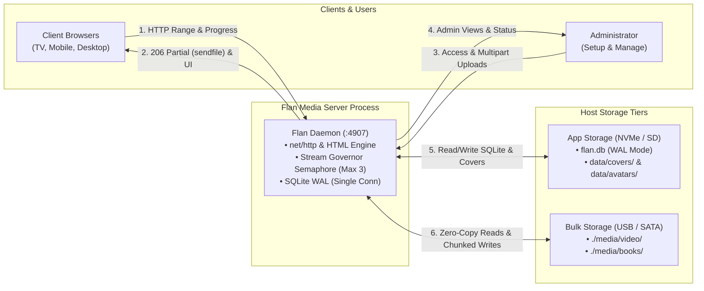
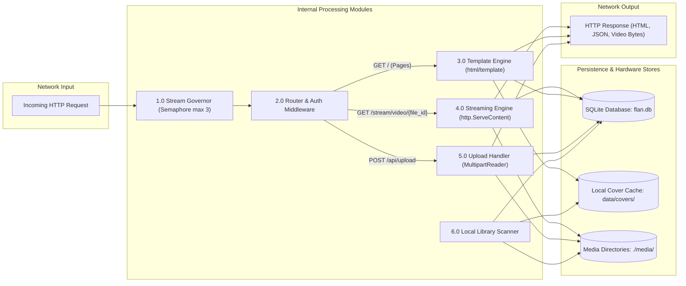
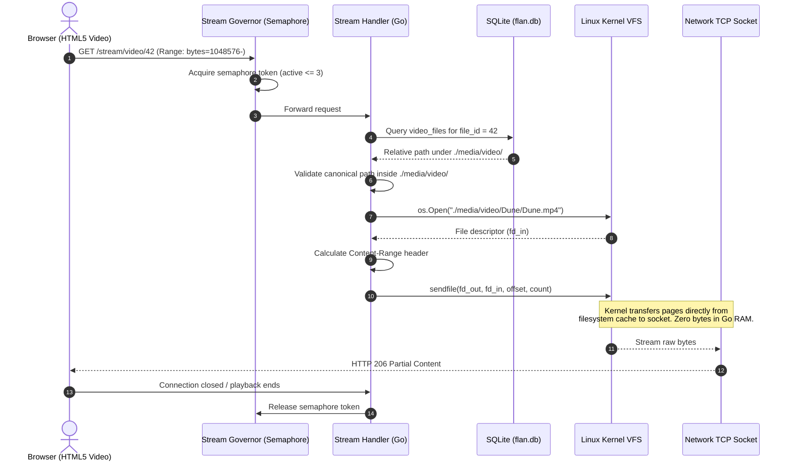
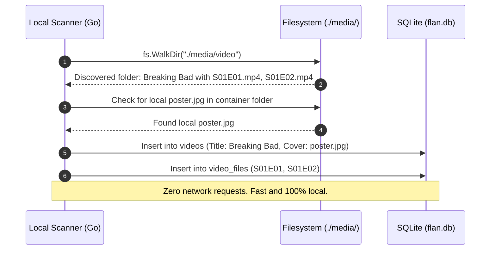
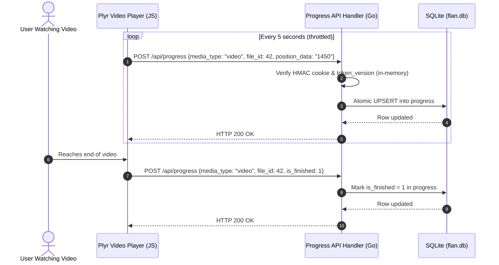
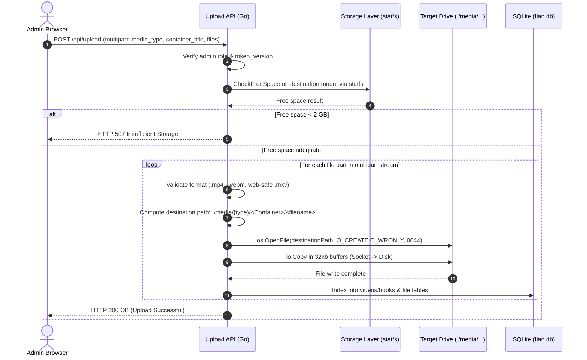

# Data Flow & Architecture Diagrams

UML sequence diagrams and Data Flow Diagrams (DFD) illustrating system data flows.

---

## 1. Context Data Flow (Level 0 DFD)

High-level boundaries between external clients, host storage tiers, and the Flan daemon process. Flan operates 100% offline with zero external cloud dependencies.

```mermaid
flowchart LR
    subgraph Clients["Clients & Users"]
        direction TB
        Browser["Client Browsers<br/>(TV, Mobile, Desktop)"]
        Admin["Administrator<br/>(Setup & Manage)"]
    end

    subgraph Core["Flan Media Server Process"]
        Daemon["Flan Daemon (:4907)<br/>• net/http & HTML Engine<br/>• Stream Governor Semaphore (Max 3)<br/>• SQLite WAL (Single Conn)"]
    end

    subgraph Storage["Host Storage Tiers"]
        direction TB
        AppData["App Storage (NVMe / SD)<br/>• flan.db (WAL Mode)<br/>• data/covers/ & data/avatars/"]
        BulkMedia["Bulk Storage (USB / SATA)<br/>• ./media/video/<br/>• ./media/books/"]
    end

    Browser -->|"1. HTTP Range & Progress"| Daemon
    Daemon -->|"2. 206 Partial (sendfile) & UI"| Browser
    Admin -->|"3. Access & Multipart Uploads"| Daemon
    Daemon -->|"4. Admin Views & Status"| Admin
    Daemon <-->|"5. Read/Write SQLite & Covers"| AppData
    Daemon <-->|"6. Zero-Copy Reads & Chunked Writes"| BulkMedia
```

---

## 2. Component Data Flow (Level 1 DFD)

Internal data movement between router, middlewares, engines, and persistence layers.

```mermaid
flowchart LR
    subgraph Input["Network Input"]
        Request["Incoming HTTP Request"]
    end

    subgraph Core["Internal Processing Modules"]
        Governor["1.0 Stream Governor (Semaphore max 3)"]
        Router["2.0 Router & Auth Middleware"]
        PageEngine["3.0 Template Engine (html/template)"]
        StreamEngine["4.0 Streaming Engine (http.ServeContent)"]
        UploadEngine["5.0 Upload Handler (MultipartReader)"]
        Scanner["6.0 Local Library Scanner"]
    end

    subgraph Stores["Persistence & Hardware Stores"]
        SQLite[("SQLite Database: flan.db")]
        Covers[("Local Cover Cache: data/covers/")]
        HostDrives[("Media Directories: ./media/")]
    end

    subgraph Output["Network Output"]
        Response["HTTP Response (HTML, JSON, Video Bytes)"]
    end

    Request --> Governor
    Governor --> Router
    Router -- "GET /stream/video/{file_id}" --> StreamEngine
    Router -- "GET / (Pages)" --> PageEngine
    Router -- "POST /api/upload" --> UploadEngine
    StreamEngine --> SQLite
    StreamEngine --> HostDrives
    StreamEngine --> Response
    PageEngine --> SQLite
    PageEngine --> Covers
    PageEngine --> Response
    UploadEngine --> HostDrives
    UploadEngine --> SQLite
    UploadEngine --> Response
    Scanner --> HostDrives
    Scanner --> SQLite
    Scanner --> Covers
```

---

## 3. Zero-Copy Video Streaming (UML Sequence)

Shows how byte range requests trigger Linux `sendfile`, moving data directly from kernel cache to socket buffers without touching Go heap RAM.

```mermaid
sequenceDiagram
    autonumber
    actor Client as Browser (HTML5 Video)
    participant Gov as Stream Governor (Semaphore)
    participant Handler as Stream Handler (Go)
    participant DB as SQLite (flan.db)
    participant VFS as Linux Kernel VFS
    participant Socket as Network TCP Socket

    Client->>Gov: GET /stream/video/42 (Range: bytes=1048576-)
    Gov->>Gov: Acquire semaphore token (active <= 3)
    Gov->>Handler: Forward request
    Handler->>DB: Query video_files for file_id = 42
    DB-->>Handler: Relative path under ./media/video/
    Handler->>Handler: Validate canonical path inside ./media/video/
    Handler->>VFS: os.Open("./media/video/Dune/Dune.mp4")
    VFS-->>Handler: File descriptor (fd_in)
    Handler->>Handler: Calculate Content-Range header
    Handler->>VFS: sendfile(fd_out, fd_in, offset, count)
    Note over VFS,Socket: Kernel transfers pages directly from<br/>filesystem cache to socket. Zero bytes in Go RAM.
    VFS-->>Socket: Stream raw bytes
    Socket-->>Client: HTTP 206 Partial Content
    Client->>Handler: Connection closed / playback ends
    Handler->>Gov: Release semaphore token
```

---

## 4. Local Ingestion Data Flow (UML Sequence)

Scanning discovered media containers, local artwork verification, and direct SQLite insertion.

```mermaid
sequenceDiagram
    autonumber
    participant Scanner as Local Scanner (Go)
    participant Disk as Filesystem (./media/)
    participant DB as SQLite (flan.db)

    Scanner->>Disk: fs.WalkDir("./media/video")
    Disk-->>Scanner: Discovered folder: Breaking Bad with S01E01.mp4, S01E02.mp4
    Scanner->>Disk: Check for local poster.jpg in container folder
    Disk-->>Scanner: Found local poster.jpg
    Scanner->>DB: Insert into videos (Title: Breaking Bad, Cover: poster.jpg)
    Scanner->>DB: Insert into video_files (S01E01, S01E02)
    Note over Scanner,DB: Zero network requests. Fast and 100% local.
```

---

## 5. Playback Progress Sync Loop

Client playback synchronization with the normalized SQLite database.

```mermaid
sequenceDiagram
    autonumber
    actor User as User Watching Video
    participant Player as Plyr Video Player (JS)
    participant API as Progress API Handler (Go)
    participant DB as SQLite (flan.db)

    loop Every 5 seconds (throttled)
        Player->>API: POST /api/progress {media_type: "video", file_id: 42, position_data: "1450"}
        API->>API: Verify HMAC cookie & token_version (in-memory)
        API->>DB: Atomic UPSERT into progress
        DB-->>API: Row updated
        API-->>Player: HTTP 200 OK
    end
    User->>Player: Reaches end of video
    Player->>API: POST /api/progress {media_type: "video", file_id: 42, is_finished: 1}
    API->>DB: Mark is_finished = 1 in progress
    DB-->>API: Row updated
    API-->>Player: HTTP 200 OK
```

---

## 6. Admin Zero-Memory File Upload Data Flow

Browser-based media uploads streamed directly to disk into the appropriate container directory.

```mermaid
sequenceDiagram
    autonumber
    actor Admin as Admin Browser
    participant Handler as Upload API (Go)
    participant Storage as Storage Layer (statfs)
    participant Disk as Target Drive (./media/...)
    participant DB as SQLite (flan.db)

    Admin->>Handler: POST /api/upload (multipart: media_type, container_title, files)
    Handler->>Handler: Verify admin role & token_version
    Handler->>Storage: CheckFreeSpace on destination mount via statfs
    Storage-->>Handler: Free space result
    alt Free space < 2 GB
        Handler-->>Admin: HTTP 507 Insufficient Storage
    else Free space adequate
        loop For each file part in multipart stream
            Handler->>Handler: Validate format (.mp4, .webm, web-safe .mkv)
            Handler->>Handler: Compute destination path: ./media/{type}/<Container>/<filename>
            Handler->>Disk: os.OpenFile(destinationPath, O_CREATE|O_WRONLY, 0644)
            Handler->>Disk: io.Copy in 32kb buffers (Socket -> Disk)
            Disk-->>Handler: File write complete
            Handler->>DB: Index into videos/books & file tables
        end
        Handler-->>Admin: HTTP 200 OK (Upload Successful)
    end
```

---

## 7. Related Documentation

* [User Flows](user-flows.md)
* [Master System Architecture](../design.md)
* [Two-Safeguard Rate Limiting](../rate-limiting.md)
* [Storage Architecture](../storage.md)
