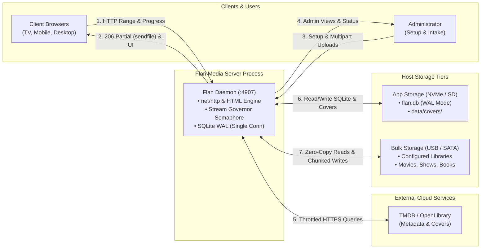
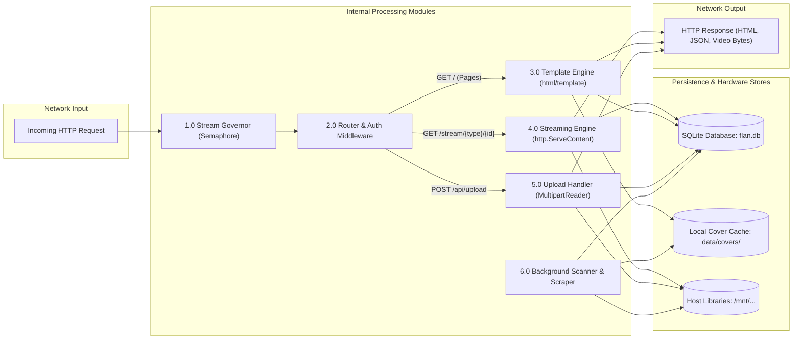
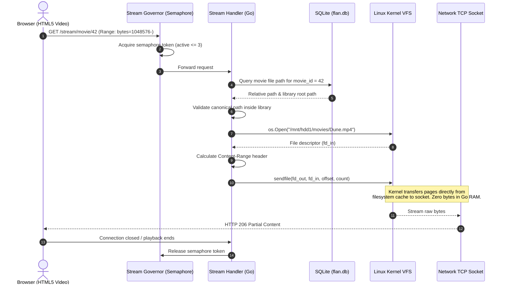
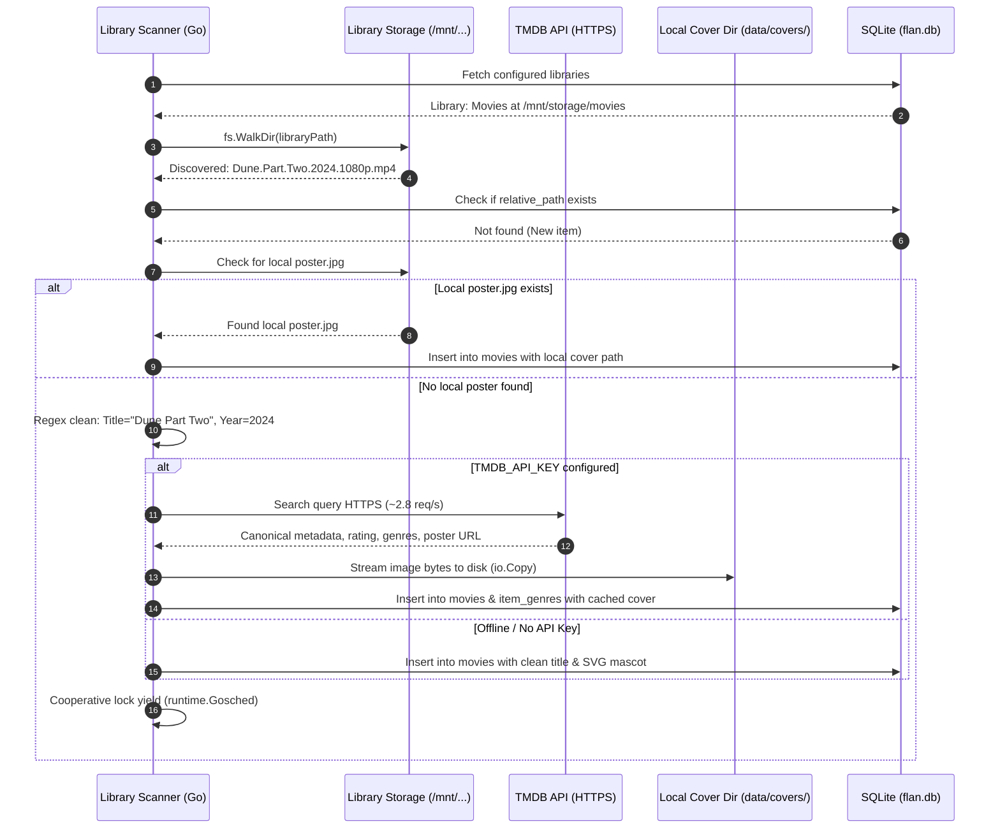
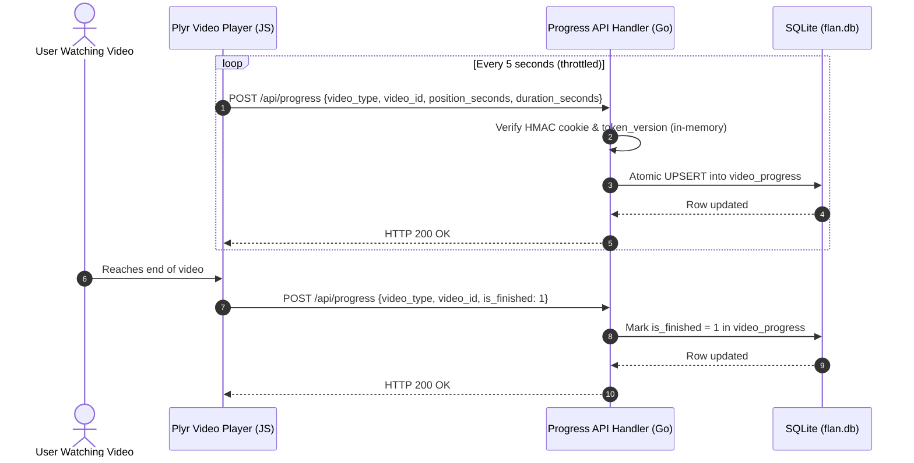
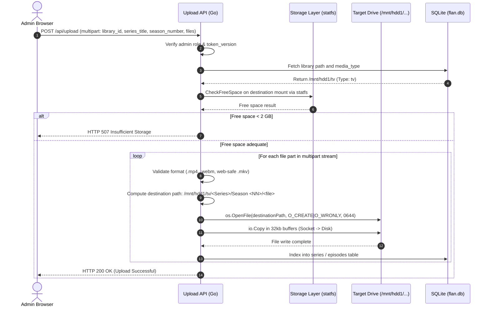

# Data Flow & Architecture Diagrams

UML sequence diagrams and Data Flow Diagrams (DFD) illustrating system data flows.

---

## 1. Context Data Flow (Level 0 DFD)

High-level boundaries between external clients, upstream providers, host storage tiers, and the Flan daemon process.

```mermaid
flowchart LR
    subgraph Clients["Clients & Users"]
        direction TB
        Browser["Client Browsers<br/>(TV, Mobile, Desktop)"]
        Admin["Administrator<br/>(Setup & Intake)"]
    end

    subgraph Core["Flan Media Server Process"]
        Daemon["Flan Daemon (:4907)<br/>• net/http & HTML Engine<br/>• Stream Governor Semaphore<br/>• SQLite WAL (Single Conn)"]
    end

    subgraph External["External Cloud Services"]
        TMDB["TMDB / OpenLibrary<br/>(Metadata & Covers)"]
    end

    subgraph Storage["Host Storage Tiers"]
        direction TB
        AppData["App Storage (NVMe / SD)<br/>• flan.db (WAL Mode)<br/>• data/covers/"]
        BulkMedia["Bulk Storage (USB / SATA)<br/>• Configured Libraries<br/>• Movies, Shows, Books"]
    end

    Browser -->|"1. HTTP Range & Progress"| Daemon
    Daemon -->|"2. 206 Partial (sendfile) & UI"| Browser
    Admin -->|"3. Setup & Multipart Uploads"| Daemon
    Daemon -->|"4. Admin Views & Status"| Admin
    Daemon <-->|"5. Throttled HTTPS Queries"| TMDB
    Daemon <-->|"6. Read/Write SQLite & Covers"| AppData
    Daemon <-->|"7. Zero-Copy Reads & Chunked Writes"| BulkMedia
```

---

## 2. Component Data Flow (Level 1 DFD)

Internal data movement between router, middlewares, engines, and persistence layers.

```mermaid
flowchart LR
    subgraph Input["Network Input"]
        Request["Incoming HTTP Request"]
    end

    subgraph Core["Internal Processing Modules"]
        Governor["1.0 Stream Governor (Semaphore)"]
        Router["2.0 Router & Auth Middleware"]
        PageEngine["3.0 Template Engine (html/template)"]
        StreamEngine["4.0 Streaming Engine (http.ServeContent)"]
        UploadEngine["5.0 Upload Handler (MultipartReader)"]
        Scanner["6.0 Background Scanner & Scraper"]
    end

    subgraph Stores["Persistence & Hardware Stores"]
        SQLite[("SQLite Database: flan.db")]
        Covers[("Local Cover Cache: data/covers/")]
        HostDrives[("Host Libraries: /mnt/...")]
    end

    subgraph Output["Network Output"]
        Response["HTTP Response (HTML, JSON, Video Bytes)"]
    end

    Request --> Governor
    Governor --> Router
    Router -- "GET /stream/{type}/{id}" --> StreamEngine
    Router -- "GET / (Pages)" --> PageEngine
    Router -- "POST /api/upload" --> UploadEngine
    StreamEngine --> SQLite
    StreamEngine --> HostDrives
    StreamEngine --> Response
    PageEngine --> SQLite
    PageEngine --> Covers
    PageEngine --> Response
    UploadEngine --> HostDrives
    UploadEngine --> SQLite
    UploadEngine --> Response
    Scanner --> HostDrives
    Scanner --> SQLite
    Scanner --> Covers
```

---

## 3. Zero-Copy Video Streaming (UML Sequence)

Shows how byte range requests trigger Linux `sendfile`, moving data directly from kernel cache to socket buffers without touching Go heap RAM.

```mermaid
sequenceDiagram
    autonumber
    actor Client as Browser (HTML5 Video)
    participant Gov as Stream Governor (Semaphore)
    participant Handler as Stream Handler (Go)
    participant DB as SQLite (flan.db)
    participant VFS as Linux Kernel VFS
    participant Socket as Network TCP Socket

    Client->>Gov: GET /stream/movie/42 (Range: bytes=1048576-)
    Gov->>Gov: Acquire semaphore token (active <= 3)
    Gov->>Handler: Forward request
    Handler->>DB: Query movie file path for movie_id = 42
    DB-->>Handler: Relative path & library root path
    Handler->>Handler: Validate canonical path inside library
    Handler->>VFS: os.Open("/mnt/hdd1/movies/Dune.mp4")
    VFS-->>Handler: File descriptor (fd_in)
    Handler->>Handler: Calculate Content-Range header
    Handler->>VFS: sendfile(fd_out, fd_in, offset, count)
    Note over VFS,Socket: Kernel transfers pages directly from<br/>filesystem cache to socket. Zero bytes in Go RAM.
    VFS-->>Socket: Stream raw bytes
    Socket-->>Client: HTTP 206 Partial Content
    Client->>Handler: Connection closed / playback ends
    Handler->>Gov: Release semaphore token
```

---

## 4. Ingestion & Scraping Data Flow (UML Sequence)

Scanning discovered media, local artwork verification, and throttled online metadata enrichment.

```mermaid
sequenceDiagram
    autonumber
    participant Scanner as Library Scanner (Go)
    participant Disk as Library Storage (/mnt/...)
    participant TMDB as TMDB API (HTTPS)
    participant Covers as Local Cover Dir (data/covers/)
    participant DB as SQLite (flan.db)

    Scanner->>DB: Fetch configured libraries
    DB-->>Scanner: Library: Movies at /mnt/storage/movies
    Scanner->>Disk: fs.WalkDir(libraryPath)
    Disk-->>Scanner: Discovered: Dune.Part.Two.2024.1080p.mp4
    Scanner->>DB: Check if relative_path exists
    DB-->>Scanner: Not found (New item)
    Scanner->>Disk: Check for local poster.jpg
    alt Local poster.jpg exists
        Disk-->>Scanner: Found local poster.jpg
        Scanner->>DB: Insert into movies with local cover path
    else No local poster found
        Scanner->>Scanner: Regex clean: Title="Dune Part Two", Year=2024
        alt TMDB_API_KEY configured
            Scanner->>TMDB: Search query HTTPS (~2.8 req/s)
            TMDB-->>Scanner: Canonical metadata, rating, genres, poster URL
            Scanner->>Covers: Stream image bytes to disk (io.Copy)
            Scanner->>DB: Insert into movies & item_genres with cached cover
        else Offline / No API Key
            Scanner->>DB: Insert into movies with clean title & SVG mascot
        end
        Scanner->>Scanner: Cooperative lock yield (runtime.Gosched)
    end
```

---

## 5. Playback Progress Sync Loop

Client playback synchronization with the normalized SQLite database.

```mermaid
sequenceDiagram
    autonumber
    actor User as User Watching Video
    participant Player as Plyr Video Player (JS)
    participant API as Progress API Handler (Go)
    participant DB as SQLite (flan.db)

    loop Every 5 seconds (throttled)
        Player->>API: POST /api/progress {video_type, video_id, position_seconds, duration_seconds}
        API->>API: Verify HMAC cookie & token_version (in-memory)
        API->>DB: Atomic UPSERT into video_progress
        DB-->>API: Row updated
        API-->>Player: HTTP 200 OK
    end
    User->>Player: Reaches end of video
    Player->>API: POST /api/progress {video_type, video_id, is_finished: 1}
    API->>DB: Mark is_finished = 1 in video_progress
    DB-->>API: Row updated
    API-->>Player: HTTP 200 OK
```

---

## 6. Admin Zero-Memory File Upload Data Flow

Browser-based media uploads streamed directly to disk into the appropriate season/movie directory.

```mermaid
sequenceDiagram
    autonumber
    actor Admin as Admin Browser
    participant Handler as Upload API (Go)
    participant Storage as Storage Layer (statfs)
    participant Disk as Target Drive (/mnt/hdd1/...)
    participant DB as SQLite (flan.db)

    Admin->>Handler: POST /api/upload (multipart: library_id, series_title, season_number, files)
    Handler->>Handler: Verify admin role & token_version
    Handler->>DB: Fetch library path and media_type
    DB-->>Handler: Return /mnt/hdd1/tv (Type: tv)
    Handler->>Storage: CheckFreeSpace on destination mount via statfs
    Storage-->>Handler: Free space result
    alt Free space < 2 GB
        Handler-->>Admin: HTTP 507 Insufficient Storage
    else Free space adequate
        loop For each file part in multipart stream
            Handler->>Handler: Validate format (.mp4, .webm, web-safe .mkv)
            Handler->>Handler: Compute destination path: /mnt/hdd1/tv/<Series>/Season <NN>/<file>
            Handler->>Disk: os.OpenFile(destinationPath, O_CREATE|O_WRONLY, 0644)
            Handler->>Disk: io.Copy in 32kb buffers (Socket -> Disk)
            Disk-->>Handler: File write complete
            Handler->>DB: Index into series / episodes table
        end
        Handler-->>Admin: HTTP 200 OK (Upload Successful)
    end
```

---

## 7. Related Documentation

* [User Flows](user-flows.md)
* [Master System Architecture](../design.md)
* [Rate Limiting Architecture](../rate-limiting.md)
* [Storage Architecture](../storage.md)
