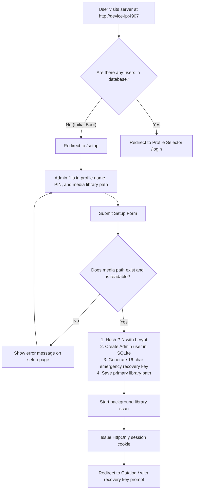
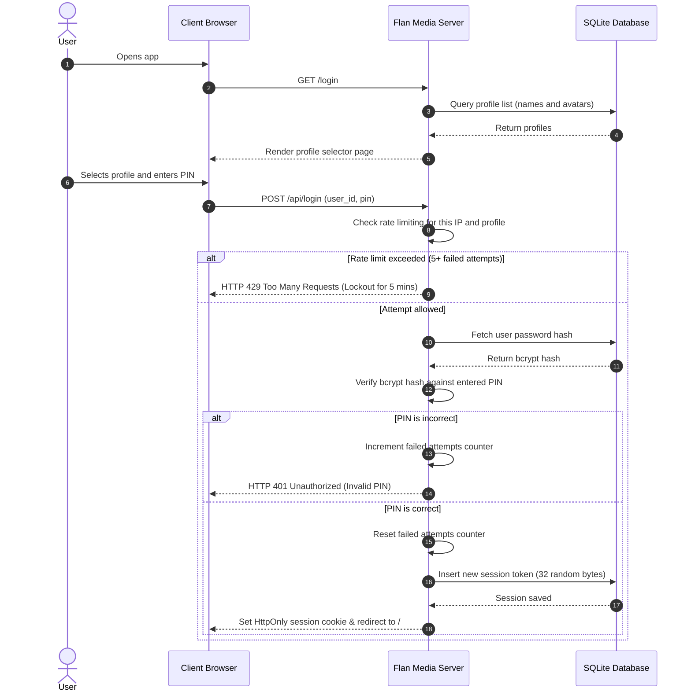
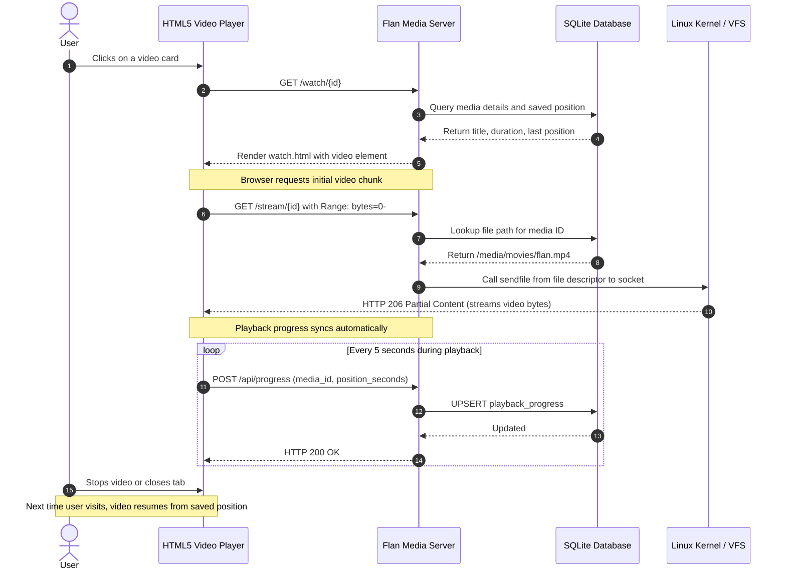
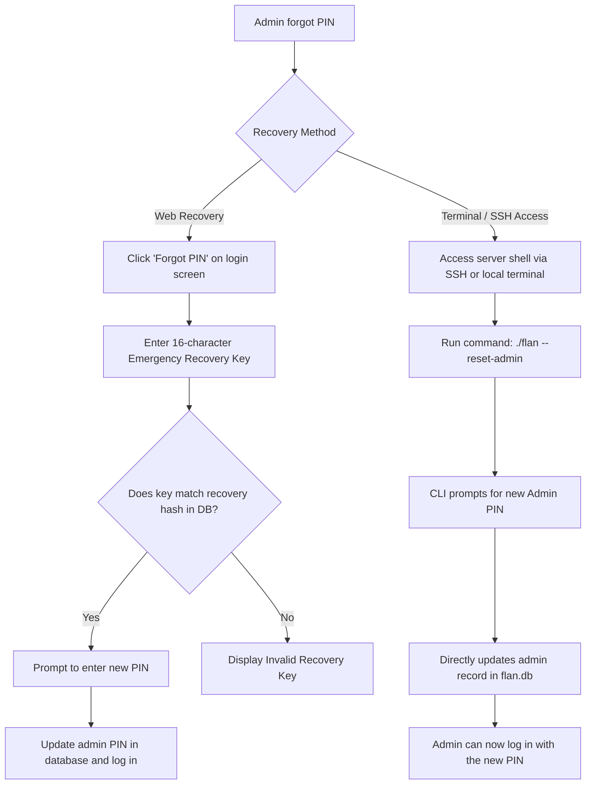

# User Design & System Flow Diagrams

This document illustrates the key user flows and technical workflows for Flan Media Server.

---

## 1. First-Time Setup Wizard

When the server runs for the first time with an empty database, it guides the administrator through a single onboarding screen before locking the setup route.

---

## 2. Profile Selection and PIN Authentication

Returning users see a friendly profile selection screen ("Who is watching?") and log in using their numeric PIN with brute-force protection.

---

## 3. Media Streaming and Progress Tracking

Demonstrates zero-copy streaming using the Linux sendfile system call and how playback progress is automatically saved to allow resuming later.

---

## 4. File Intake: Local In-Place Scan vs Admin Web Upload

Flan Media Server supports both referencing existing media collections on the host and uploading new folders through the browser without memory bloat.

```mermaid
flowchart TD
    subgraph Local["Method A: Local Directory Scanning (Existing Collections)"]
        A1["Admin adds folder path in Settings e.g. /mnt/storage/movies"] --> A2["Server validates directory existence and read permissions"]
        A2 --> A3["Background worker walks directory tree recursively"]
        A3 --> A4["Extract file size, format, and parse title/season/episode"]
        A4 --> A5["Insert into media_items table (files stay in place on disk)"]
    end

    subgraph Remote["Method B: Admin Web Upload (Streaming Intake)"]
        B1["Admin drags folder into Web UI upload modal"] --> B2["Browser sends multipart stream via POST /api/upload"]
        B2 --> B3["Server checks available disk space via statfs"]
        B3 -- "Disk low (<2gb)" --> B4["Reject upload with HTTP 507 Insufficient Storage"]
        B3 -- "Space OK" --> B5["r.MultipartReader reads incoming file parts"]
        B5 --> B6["io.Copy streams directly from socket to destination file in 32kb chunks"]
        B6 --> B7["Save file with 0644 permissions (non-executable)"]
        B7 --> B8["Index new file into SQLite database"]
    end
```

---

## 5. Admin Account Recovery Flow

Demonstrates the two paths for recovering the admin account if a PIN is forgotten.

