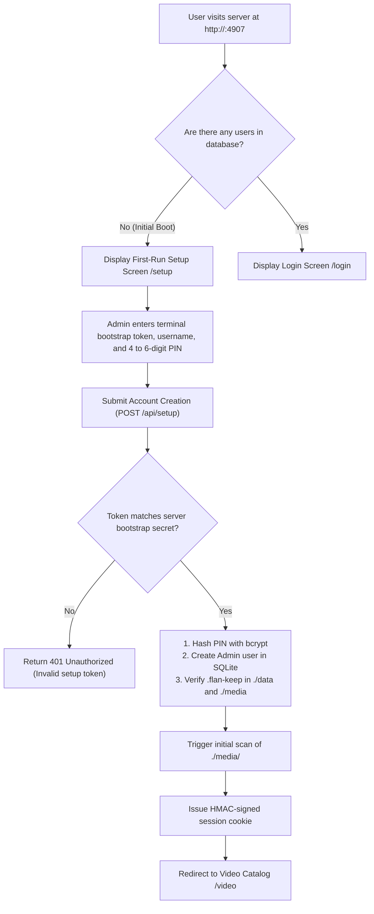
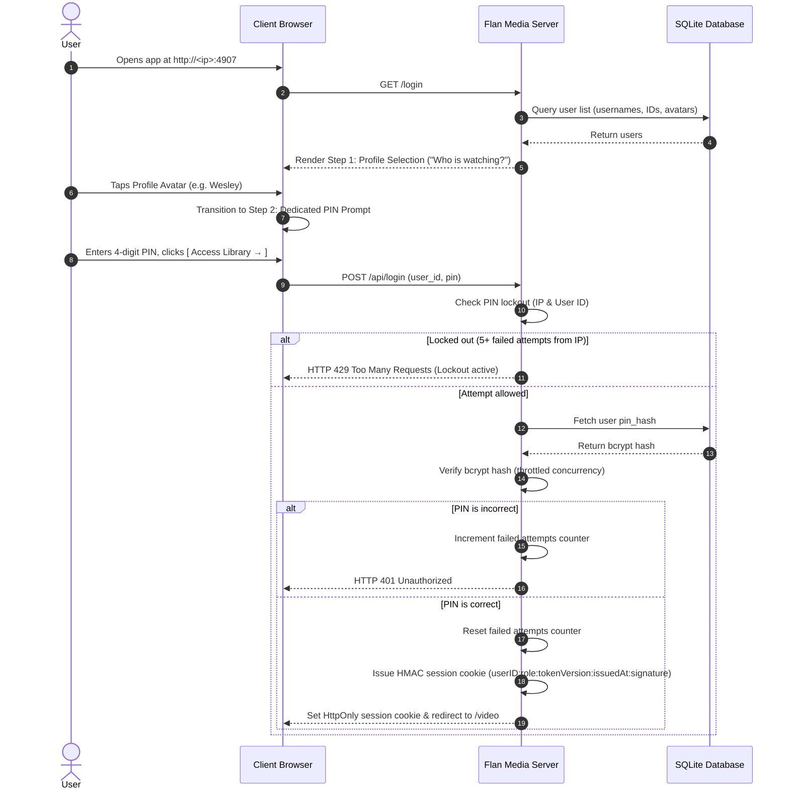
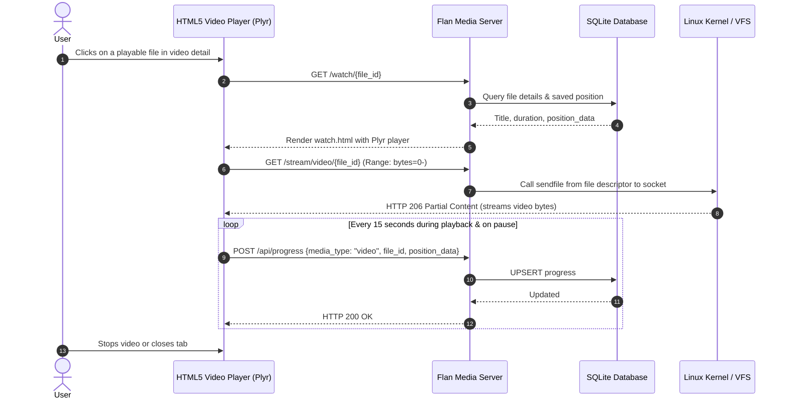
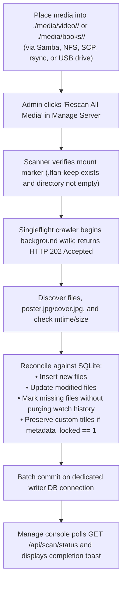
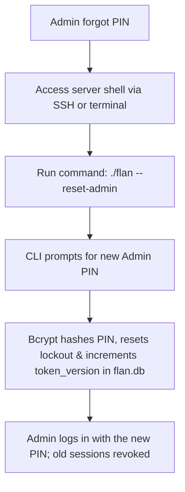

# User Design & System Flow Diagrams

Visual workflows and interaction journeys for key user tasks in Flan Media Server.

---

## 1. First-Time Setup & Onboarding Flow

On initial boot with an empty database, the server outputs a one-time bootstrap setup token to stdout/journal and routes visits to the setup screen.

```mermaid
flowchart TD
    Start["User visits server at http://<ip>:4907"] --> CheckDB{"Are there any users in database?"}
    CheckDB -- "No (Initial Boot)" --> ShowSetup["Display First-Run Setup Screen /setup"]
    CheckDB -- "Yes" --> ShowLogin["Display Login Screen /login"]

    ShowSetup --> Form["Admin enters terminal bootstrap token, username, and 4 to 6-digit PIN"]
    Form --> Submit["Submit Account Creation (POST /api/setup)"]

    Submit --> VerifyToken{"Token matches server bootstrap secret?"}
    VerifyToken -- "No" --> Reject["Return 401 Unauthorized (Invalid setup token)"]
    VerifyToken -- "Yes" --> CreateAdmin["1. Hash PIN with bcrypt<br/>2. Create Admin user in SQLite<br/>3. Verify .flan-keep in ./data and ./media"]
    CreateAdmin --> StartScan["Trigger initial scan of ./media/"]
    StartScan --> IssueSession["Issue HMAC-signed session cookie"]
    IssueSession --> Catalog["Redirect to Video Catalog /video"]
```

---

## 2. 2-Step Sequential Login & PIN Authentication
 
Returning users first select their profile avatar (Step 1), then enter their numeric PIN (Step 2), protected by PIN lockout (Safeguard 2).
 

```mermaid
sequenceDiagram
    autonumber
    actor User
    participant Browser as Client Browser
    participant Server as Flan Media Server
    participant DB as SQLite Database

    User->>Browser: Opens app at http://<ip>:4907
    Browser->>Server: GET /login
    Server->>DB: Query user list (usernames, IDs, avatars)
    DB-->>Server: Return users
    Server-->>Browser: Render Step 1: Profile Selection ("Who is watching?")
    User->>Browser: Taps Profile Avatar (e.g. Wesley)
    Browser->>Browser: Transition to Step 2: Dedicated PIN Prompt
    User->>Browser: Enters 4-digit PIN, clicks [ Access Library → ]
    Browser->>Server: POST /api/login (user_id, pin)
    Server->>Server: Check PIN lockout (IP & User ID)
    alt Locked out (5+ failed attempts from IP)
        Server-->>Browser: HTTP 429 Too Many Requests (Lockout active)
    else Attempt allowed
        Server->>DB: Fetch user pin_hash
        DB-->>Server: Return bcrypt hash
        Server->>Server: Verify bcrypt hash (throttled concurrency)
        alt PIN is incorrect
            Server->>Server: Increment failed attempts counter
            Server-->>Browser: HTTP 401 Unauthorized
        else PIN is correct
            Server->>Server: Reset failed attempts counter
            Server->>Server: Issue HMAC session cookie (userID:role:tokenVersion:issuedAt:signature)
            Server-->>Browser: Set HttpOnly session cookie & redirect to /video
        end
    end
```

---

## 3. Media Streaming & Progress Sync

Zero-copy `sendfile` video delivery and automated 15-second watch progress syncing.

```mermaid
sequenceDiagram
    autonumber
    actor User
    participant Browser as HTML5 Video Player (Plyr)
    participant Server as Flan Media Server
    participant DB as SQLite Database
    participant Kernel as Linux Kernel / VFS

    User->>Browser: Clicks on a playable file in video detail
    Browser->>Server: GET /watch/{file_id}
    Server->>DB: Query file details & saved position
    DB-->>Server: Title, duration, position_data
    Server-->>Browser: Render watch.html with Plyr player
    Browser->>Server: GET /stream/video/{file_id} (Range: bytes=0-)
    Server->>Kernel: Call sendfile from file descriptor to socket
    Kernel-->>Browser: HTTP 206 Partial Content (streams video bytes)
    loop Every 15 seconds during playback & on pause
        Browser->>Server: POST /api/progress {media_type: "video", file_id, position_data}
        Server->>DB: UPSERT progress
        DB-->>Server: Updated
        Server-->>Browser: HTTP 200 OK
    end
    User->>Browser: Stops video or closes tab
```

---

## 4. Media Ingestion & Reconciliation Flow

Media files are populated directly onto host storage via network shares (SMB/NFS), SCP/rsync, or USB drives, followed by asynchronous reconciliation indexing.

```mermaid
flowchart TD
    A1["Place media into ./media/video/<Container>/ or ./media/books/<Container>/<br/>(via Samba, NFS, SCP, rsync, or USB drive)"] --> A2["Admin clicks 'Rescan All Media' in Manage Server"]
    A2 --> A3["Scanner verifies mount marker (.flan-keep exists and directory not empty)"]
    A3 --> A4["Singleflight crawler begins background walk; returns HTTP 202 Accepted"]
    A4 --> A5["Discover files, poster.jpg/cover.jpg, and check mtime/size"]
    A5 --> A6["Reconcile against SQLite:<br/>• Insert new files<br/>• Update modified files<br/>• Mark missing files without purging watch history<br/>• Preserve custom titles if metadata_locked == 1"]
    A6 --> A7["Batch commit on dedicated writer DB connection"]
    A7 --> A8["Manage console polls GET /api/scan/status and displays completion toast"]
```

---

## 5. Admin Account Recovery Flow

Failsafe CLI command to reset a forgotten admin PIN directly on the host shell.

```mermaid
flowchart TD
    Forgot["Admin forgot PIN"] --> Terminal["Access server shell via SSH or terminal"]
    Terminal --> RunCLI["Run command: ./flan --reset-admin"]
    RunCLI --> Interactive["CLI prompts for new Admin PIN"]
    Interactive --> DirectDB["Bcrypt hashes PIN, resets lockout & increments token_version in flan.db"]
    DirectDB --> Done["Admin logs in with the new PIN; old sessions revoked"]
```

---

## 6. Related Documentation

* [Data Flow Diagrams](data-flow.md)
* [Page Templates & Wireframes](../client/pages.md)
* [Master System Architecture](../design.md)
* [Threat Model & Recovery](../threat-model.md)
