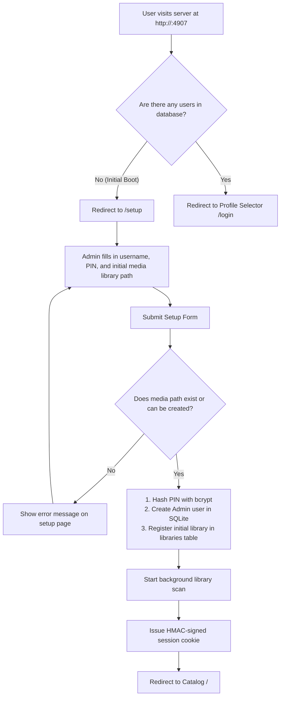
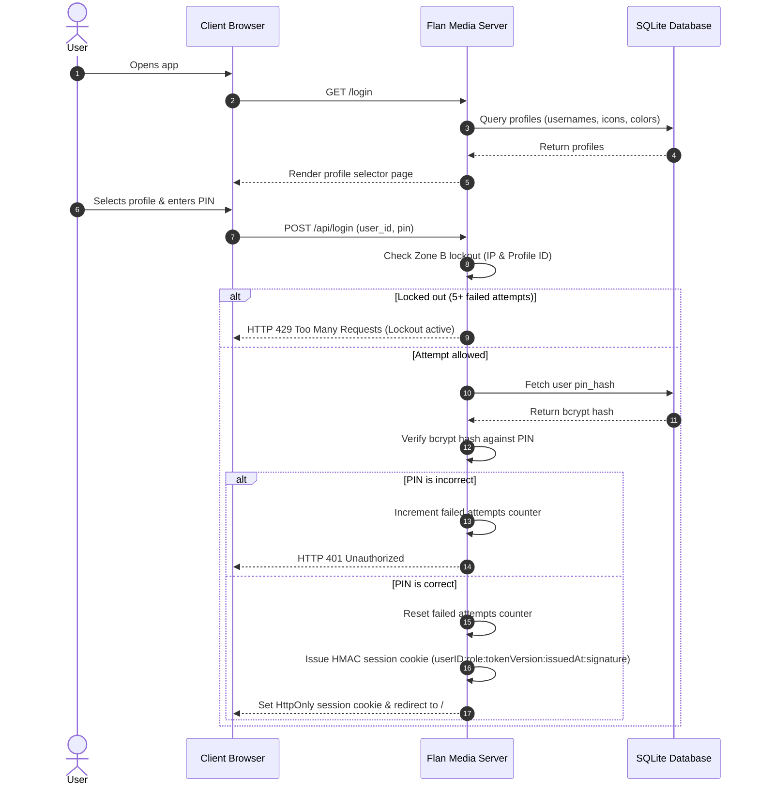
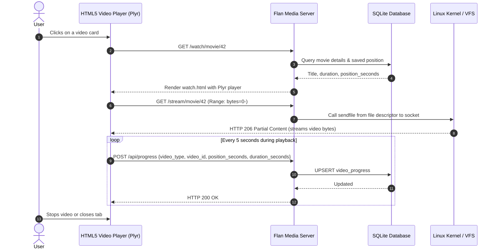
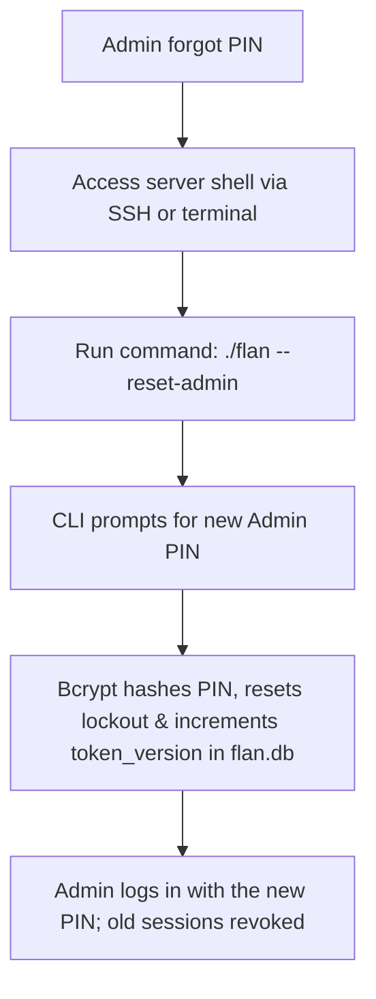

# User Design & System Flow Diagrams

Visual workflows and interaction journeys for key user tasks in Flan Media Server.

---

## 1. First-Time Setup Wizard

On initial boot with an empty database, the server automatically routes requests to `/setup` and disables the route once complete.

```mermaid
flowchart TD
    Start["User visits server at http://<ip>:4907"] --> CheckDB{"Are there any users in database?"}
    CheckDB -- "No (Initial Boot)" --> RedirectSetup["Redirect to /setup"]
    CheckDB -- "Yes" --> ShowLogin["Redirect to Profile Selector /login"]

    RedirectSetup --> Form["Admin fills in username, PIN, and initial media library path"]
    Form --> Submit["Submit Setup Form"]

    Submit --> ValidatePath{"Does media path exist or can be created?"}
    ValidatePath -- "No" --> Error["Show error message on setup page"]
    Error --> Form

    ValidatePath -- "Yes" --> CreateAdmin["1. Hash PIN with bcrypt<br/>2. Create Admin user in SQLite<br/>3. Register initial library in libraries table"]
    CreateAdmin --> StartScan["Start background library scan"]
    StartScan --> IssueSession["Issue HMAC-signed session cookie"]
    IssueSession --> Catalog["Redirect to Catalog /"]
```

---

## 2. Profile Selection & PIN Authentication

Returning users select their profile tile and enter their numeric PIN, protected by Zone B brute-force lockouts.

```mermaid
sequenceDiagram
    autonumber
    actor User
    participant Browser as Client Browser
    participant Server as Flan Media Server
    participant DB as SQLite Database

    User->>Browser: Opens app
    Browser->>Server: GET /login
    Server->>DB: Query profiles (usernames, icons, colors)
    DB-->>Server: Return profiles
    Server-->>Browser: Render profile selector page
    User->>Browser: Selects profile & enters PIN
    Browser->>Server: POST /api/login (user_id, pin)
    Server->>Server: Check Zone B lockout (IP & Profile ID)
    alt Locked out (5+ failed attempts)
        Server-->>Browser: HTTP 429 Too Many Requests (Lockout active)
    else Attempt allowed
        Server->>DB: Fetch user pin_hash
        DB-->>Server: Return bcrypt hash
        Server->>Server: Verify bcrypt hash against PIN
        alt PIN is incorrect
            Server->>Server: Increment failed attempts counter
            Server-->>Browser: HTTP 401 Unauthorized
        else PIN is correct
            Server->>Server: Reset failed attempts counter
            Server->>Server: Issue HMAC session cookie (userID:role:tokenVersion:issuedAt:signature)
            Server-->>Browser: Set HttpOnly session cookie & redirect to /
        end
    end
```

---

## 3. Media Streaming & Progress Sync

Zero-copy `sendfile` video delivery and automated 5-second watch progress syncing.

```mermaid
sequenceDiagram
    autonumber
    actor User
    participant Browser as HTML5 Video Player (Plyr)
    participant Server as Flan Media Server
    participant DB as SQLite Database
    participant Kernel as Linux Kernel / VFS

    User->>Browser: Clicks on a video card
    Browser->>Server: GET /watch/movie/42
    Server->>DB: Query movie details & saved position
    DB-->>Server: Title, duration, position_seconds
    Server-->>Browser: Render watch.html with Plyr player
    Browser->>Server: GET /stream/movie/42 (Range: bytes=0-)
    Server->>Kernel: Call sendfile from file descriptor to socket
    Kernel-->>Browser: HTTP 206 Partial Content (streams video bytes)
    loop Every 5 seconds during playback
        Browser->>Server: POST /api/progress {video_type, video_id, position_seconds, duration_seconds}
        Server->>DB: UPSERT video_progress
        DB-->>Server: Updated
        Server-->>Browser: HTTP 200 OK
    end
    User->>Browser: Stops video or closes tab
```

---

## 4. File Intake: Local Scan vs Admin Upload

Supports scanning existing folders in-place or streaming uploads directly to destination directories.

```mermaid
flowchart TD
    subgraph Local["Method A: Local Directory Scanning"]
        A1["Admin registers library path e.g. /mnt/hdd1/movies"] --> A2["Server validates directory existence"]
        A2 --> A3["Background worker walks directory tree recursively"]
        A3 --> A4["Check for local poster.jpg or cover art"]
        A4 --> A5["Extract file size, format, duration, and title"]
        A5 --> A6["Insert into movies / series / episodes / books tables"]
    end

    subgraph Remote["Method B: Admin Web Upload"]
        B1["Admin selects Library (and Series/Season if TV)"] --> B2["Browser sends multipart stream via POST /api/upload"]
        B2 --> B3["Check free space on target mount via statfs"]
        B3 -- "Free space < 2 GB" --> B4["Reject with HTTP 507 Insufficient Storage"]
        B3 -- "Space OK" --> B5["r.MultipartReader reads incoming file stream"]
        B5 --> B6["io.Copy streams directly to destination in 32kb chunks"]
        B6 --> B7["Save file with 0644 permissions (non-executable)"]
        B7 --> B8["Index new file into SQLite database"]
    end
```

---

## 5. Admin Account Recovery Flow

Failsafe CLI command to reset a forgotten admin PIN directly on the host shell.

```mermaid
flowchart TD
    Forgot["Admin forgot PIN"] --> Terminal["Access server shell via SSH or terminal"]
    Terminal --> RunCLI["Run command: ./flan --reset-admin"]
    RunCLI --> Interactive["CLI prompts for new Admin PIN"]
    Interactive --> DirectDB["Bcrypt hashes PIN, resets lockout & increments token_version in flan.db"]
    DirectDB --> Done["Admin logs in with the new PIN; old sessions revoked"]
```

---

## 6. Related Documentation

* [Data Flow Diagrams](data-flow.md)
* [Page Templates & Wireframes](../client/pages.md)
* [Master System Architecture](../design.md)
* [Threat Model & Recovery](../threat-model.md)
