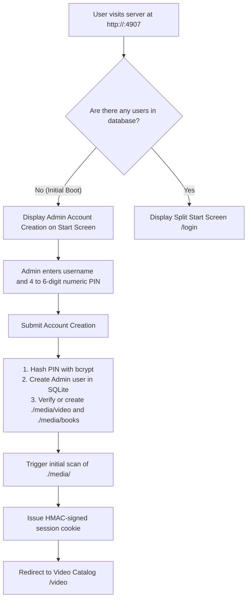
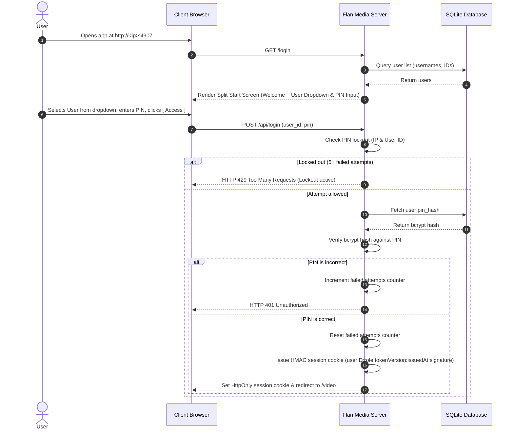
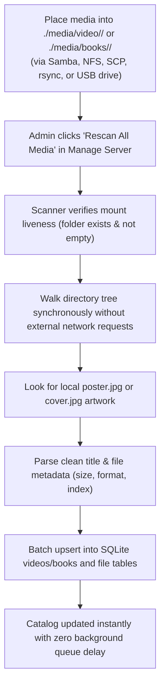
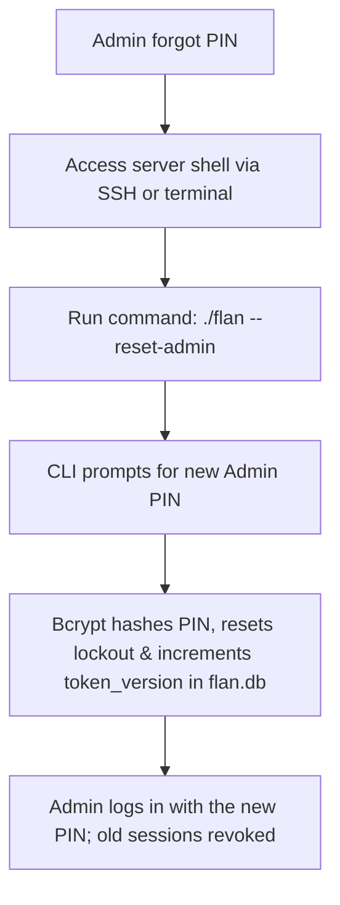

# User Design & System Flow Diagrams

Visual workflows and interaction journeys for key user tasks in Flan Media Server.

---

## 1. First-Time Setup & Onboarding Flow

On initial boot with an empty database, the server routes to the onboarding form on the Start screen to create the primary administrator.

```mermaid
flowchart TD
    Start["User visits server at http://<ip>:4907"] --> CheckDB{"Are there any users in database?"}
    CheckDB -- "No (Initial Boot)" --> ShowSetup["Display Admin Account Creation on Start Screen"]
    CheckDB -- "Yes" --> ShowLogin["Display Split Start Screen /login"]

    ShowSetup --> Form["Admin enters username and 4 to 6-digit numeric PIN"]
    Form --> Submit["Submit Account Creation"]

    Submit --> CreateAdmin["1. Hash PIN with bcrypt<br/>2. Create Admin user in SQLite<br/>3. Verify or create ./media/video and ./media/books"]
    CreateAdmin --> StartScan["Trigger initial scan of ./media/"]
    StartScan --> IssueSession["Issue HMAC-signed session cookie"]
    IssueSession --> Catalog["Redirect to Video Catalog /video"]
```

---

## 2. Split-Screen Start & PIN Authentication (Image 1)

Returning users select their name from the dropdown and enter their numeric PIN, protected by PIN lockout (Safeguard 2).

```mermaid
sequenceDiagram
    autonumber
    actor User
    participant Browser as Client Browser
    participant Server as Flan Media Server
    participant DB as SQLite Database

    User->>Browser: Opens app at http://<ip>:4907
    Browser->>Server: GET /login
    Server->>DB: Query user list (usernames, IDs)
    DB-->>Server: Return users
    Server-->>Browser: Render Split Start Screen (Welcome + User Dropdown & PIN Input)
    User->>Browser: Selects User from dropdown, enters PIN, clicks [ Access ]
    Browser->>Server: POST /api/login (user_id, pin)
    Server->>Server: Check PIN lockout (IP & User ID)
    alt Locked out (5+ failed attempts)
        Server-->>Browser: HTTP 429 Too Many Requests (Lockout active)
    else Attempt allowed
        Server->>DB: Fetch user pin_hash
        DB-->>Server: Return bcrypt hash
        Server->>Server: Verify bcrypt hash against PIN
        alt PIN is incorrect
            Server->>Server: Increment failed attempts counter
            Server-->>Browser: HTTP 401 Unauthorized
        else PIN is correct
            Server->>Server: Reset failed attempts counter
            Server->>Server: Issue HMAC session cookie (userID:role:tokenVersion:issuedAt:signature)
            Server-->>Browser: Set HttpOnly session cookie & redirect to /video
        end
    end
```

---

## 3. Media Streaming & Progress Sync

Zero-copy `sendfile` video delivery and automated 5-second watch progress syncing.

```mermaid
sequenceDiagram
    autonumber
    actor User
    participant Browser as HTML5 Video Player (Plyr)
    participant Server as Flan Media Server
    participant DB as SQLite Database
    participant Kernel as Linux Kernel / VFS

    User->>Browser: Clicks on a playable file in video detail
    Browser->>Server: GET /watch/{file_id}
    Server->>DB: Query file details & saved position
    DB-->>Server: Title, duration, position_data
    Server-->>Browser: Render watch.html with Plyr player
    Browser->>Server: GET /stream/video/{file_id} (Range: bytes=0-)
    Server->>Kernel: Call sendfile from file descriptor to socket
    Kernel-->>Browser: HTTP 206 Partial Content (streams video bytes)
    loop Every 5 seconds during playback
        Browser->>Server: POST /api/progress {media_type: "video", file_id, position_data}
        Server->>DB: UPSERT progress
        DB-->>Server: Updated
        Server-->>Browser: HTTP 200 OK
    end
    User->>Browser: Stops video or closes tab
```

---

## 4. Media Ingestion & Synchronous Rescan Flow

Media files are populated directly onto host storage via network shares (SMB/NFS), SCP/rsync, or USB drives, followed by synchronous SQLite indexing.

```mermaid
flowchart TD
    A1["Place media into ./media/video/<Container>/ or ./media/books/<Container>/<br/>(via Samba, NFS, SCP, rsync, or USB drive)"] --> A2["Admin clicks 'Rescan All Media' in Manage Server"]
    A2 --> A3["Scanner verifies mount liveness (folder exists & not empty)"]
    A3 --> A4["Walk directory tree synchronously without external network requests"]
    A4 --> A5["Look for local poster.jpg or cover.jpg artwork"]
    A5 --> A6["Parse clean title & file metadata (size, format, index)"]
    A6 --> A7["Batch upsert into SQLite videos/books and file tables"]
    A7 --> A8["Catalog updated instantly with zero background queue delay"]
```

---

## 5. Admin Account Recovery Flow

Failsafe CLI command to reset a forgotten admin PIN directly on the host shell.

```mermaid
flowchart TD
    Forgot["Admin forgot PIN"] --> Terminal["Access server shell via SSH or terminal"]
    Terminal --> RunCLI["Run command: ./flan --reset-admin"]
    RunCLI --> Interactive["CLI prompts for new Admin PIN"]
    Interactive --> DirectDB["Bcrypt hashes PIN, resets lockout & increments token_version in flan.db"]
    DirectDB --> Done["Admin logs in with the new PIN; old sessions revoked"]
```

---

## 6. Related Documentation

* [Data Flow Diagrams](data-flow.md)
* [Page Templates & Wireframes](../client/pages.md)
* [Master System Architecture](../design.md)
* [Threat Model & Recovery](../threat-model.md)
